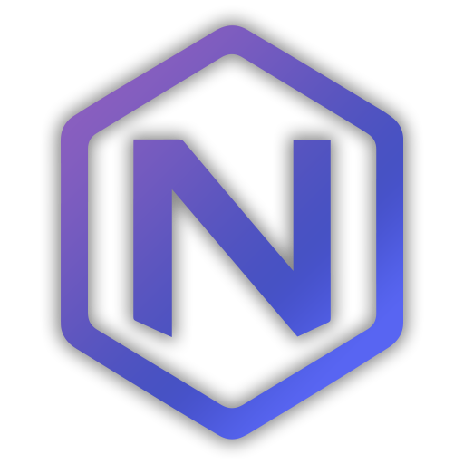

<div align="center">



# Tarkov Nexus

**See your position on [tarkov.dev](https://tarkov.dev) maps in real time.**

[](https://tarkov.nexus)
[](https://github.com/ObsidianNetwork/Tarkov-Nexus/releases/latest)
[](https://github.com/ObsidianNetwork/Tarkov-Nexus/releases)
[](https://astro.build)

[Download](https://github.com/ObsidianNetwork/Tarkov-Nexus/releases/latest) · [Website](https://tarkov.nexus) · [Report a Bug](https://github.com/ObsidianNetwork/Tarkov-Nexus/issues)

</div>

---

## About

Tarkov Nexus is a lightweight Windows companion app for **Escape from Tarkov** that monitors your game and automatically syncs your in-raid coordinates to the interactive maps on [tarkov.dev](https://tarkov.dev). Take a screenshot in-game and your marker appears on the map — no overlays, no injection, no game modification.

This repository contains:

- The **landing page** at [tarkov.nexus](https://tarkov.nexus) (built with Astro and deployed to GitHub Pages)
- The **release binaries** of the Tarkov Nexus desktop app, published under [Releases](https://github.com/ObsidianNetwork/Tarkov-Nexus/releases)

## Features

- **Real-Time Position** — Your in-game coordinates sync to tarkov.dev as you move through raids
- **Auto Map Detection** — Reads the game log and detects which map you're on, no manual selection needed
- **Screenshot Monitoring** — Watches your EFT screenshot folder and parses coordinates from filenames
- **Party System** — Host or join parties to share positions with your squad over local network
- **Privacy First** — All processing is local; only coordinates are transmitted (no screenshots or logs uploaded)
- **Quest Tracking** — Optional [TarkovTracker](https://tarkovtracker.io) integration to see quest objectives on the map

## How It Works

When you take a screenshot in Tarkov, the game saves your coordinates in the screenshot filename. Tarkov Nexus watches your screenshot folder, extracts those coordinates, and pushes them to tarkov.dev in real time.

1. **Setup** — Download Tarkov Nexus, run it, and follow the quick setup wizard.
2. **Connect** — Open tarkov.dev, navigate to any map, and paste your Remote ID into the app.
3. **Play** — Load into a raid and press your screenshot key (default: `PrintScreen`).
4. **See Your Position** — Your marker appears on the tarkov.dev map at your exact coordinates.

## What Tarkov Nexus Sends to tarkov.dev

[tarkov.dev](https://tarkov.dev) is a community-run, open-source project. Its
remote-control feature — the one that puts your marker on their map — is the
same one [TarkovMonitor](https://github.com/the-hideout/TarkovMonitor) uses, and
Tarkov Nexus is built on it. Their servers cost them money and time to run, so
this section states exactly what we send, in full.

### Over their socket server

Tarkov Nexus opens one connection to `wss://socket.tarkov.dev` and identifies
itself on the handshake:

```
Origin: TarkovNexus
User-Agent: TarkovNexus/<version>
```

It sends only the two message types their protocol defines, both of which are
relayed to the browser tab you paired with your Remote ID:

| Message | When | Contents |
|---|---|---|
| `command` → `map` | a raid starts, or you pick a map | the map name, e.g. `customs` |
| `command` → `playerPosition` | you take a screenshot, throttled to at most one per second by default | `x`, `y`, `z`, rotation, and the map name |

Plus a `pong` whenever their server sends a heartbeat.

That is the complete list. Map names are validated against tarkov.dev's own map
list before sending, so the app cannot navigate your browser to a page that does
not exist.

**Nothing else is sent.** Earlier versions of Tarkov Nexus also pushed squad
positions through their socket server using a message type their protocol does
not define. Their server logged a warning for every one of them, which is why
tarkov.dev blocked the app in August 2026. That was our mistake; those messages
have been removed, and squad markers are now drawn entirely on your own machine.

### In the map window

The in-app map window displays tarkov.dev in a frame. Because tarkov.dev sends
`X-Frame-Options: DENY`, the app runs a local proxy on `127.0.0.1:44444` that
removes **that one header** so the page can be embedded, and injects a small
script that draws your squad's markers on the map. Their
`Content-Security-Policy` and `X-Content-Type-Options` are left intact, their
cookie-consent prompt is shown to you normally rather than answered on your
behalf, and their own settings and branding are not modified.

Requests the app makes on your behalf carry `X-Tarkov-Nexus-Version`, so
tarkov.dev can identify that traffic as ours.

If you would rather not proxy anything, open tarkov.dev in your own browser and
use it normally — your position marker works there with no proxy at all, since
that is the supported path their remote-control feature was built for.

### What never leaves your machine

- **Screenshots.** Coordinates are read from the filename locally; the image is
  never uploaded, and is deleted after processing.
- **Game logs.** Parsed locally to detect which map you loaded into.
- **Squad positions.** Shared between party members and drawn on your own
  machine. They are never sent to tarkov.dev.
- **Your TarkovTracker token**, if you use quest tracking. It goes only to
  tarkovtracker.org.

## Requirements

- Windows 10 or 11 (64-bit)
- Escape from Tarkov
- A modern web browser

## Installation

1. Grab the latest `Tarkov-Nexus-Windows-x64.zip` from the [Releases page](https://github.com/ObsidianNetwork/Tarkov-Nexus/releases/latest).
2. Extract the archive anywhere on your PC.
3. Run `Tarkov-Nexus.exe` and follow the in-app setup wizard.

> Tarkov Nexus does not read or modify game memory. It only watches your EFT screenshot folder and parses the game log file for map detection.

---

## Developing the Website

The landing page is a small [Astro](https://astro.build) static site. It lives in
`website/`, which is where it moved to make room for the desktop application
source at the repository root — that source is being published here shortly.

### Prerequisites

- [Node.js](https://nodejs.org) 20 or newer
- npm

### Local Development

```bash
cd website

# install dependencies
npm install

# run dev server at http://localhost:4321
npm run dev

# build the production site to ./dist
npm run build

# preview the production build locally
npm run preview
```

### Project Structure

```
.
├── website/               # this landing page (Astro)
│   ├── public/            # static assets copied as-is to /
│   ├── src/
│   │   ├── components/    # Astro components (Hero, Features, Download, …)
│   │   ├── layouts/       # shared page layout
│   │   ├── lib/           # helpers (e.g. GitHub release fetcher)
│   │   ├── pages/         # routes (index.astro)
│   │   └── styles/        # global stylesheet
│   └── astro.config.mjs   # Astro configuration
├── Branding/              # logo and brand assets
└── .github/workflows/     # CI and the GitHub Pages deploy workflow
```

The desktop application source will be published to the repository root
(`internal/`, `ui-wails/`, `party-server/`) in a follow-up. It is not here yet.

### Deployment

The site is automatically built and deployed to GitHub Pages by [`.github/workflows/deploy.yml`](.github/workflows/deploy.yml) on every push to `main` and on each new published release. That workflow builds from `website/`, so changes to the application at the repository root do not affect the deployed site.

## Contributing

Issues and pull requests are welcome. If you find a bug in the app or have an idea for a new feature, please [open an issue](https://github.com/ObsidianNetwork/Tarkov-Nexus/issues).

## Disclaimer

Tarkov Nexus is a community-made tool and is **not affiliated with Battlestate Games** or the official Escape from Tarkov product. All trademarks belong to their respective owners.
